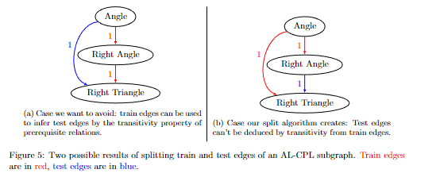
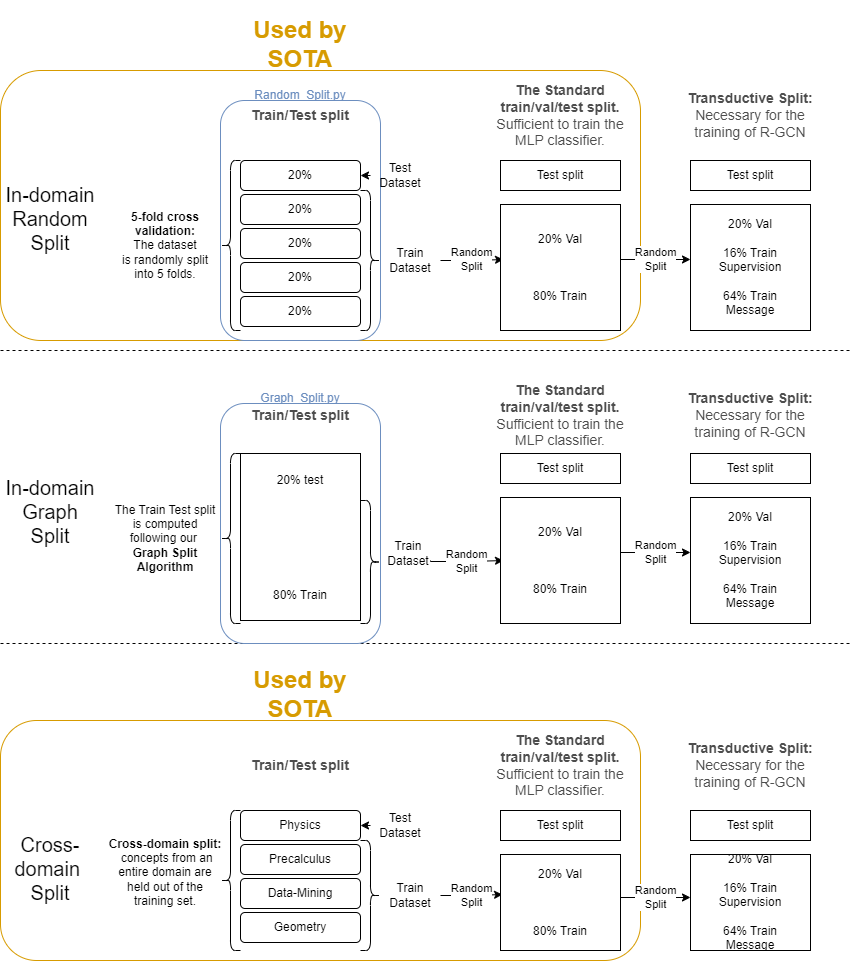
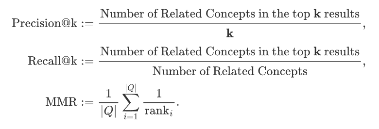

# Contextual Embeddings and Graph Convolutional Networks for Concept Prerequisite Learning

<p align="center">
    <a href="https://github.com/Learningchipmunk/AL-CPL-GraphSplit-Embeddings/">
        
    </a>
    <a href="https://www.python.org/">
            
    </a>
    <a href="https://colab.research.google.com/drive/1HfutiEhHMJLXiWGT8pcipxT5L2TpYEdt?usp=sharing">
        
    </a>
</p>


This repository contains the **code** for our `Graph Split` algorithm, the **concept embeddings** we generated using concept names and concept definitions from Wikipedia, and the **data** we used for the experiments presented in the paper: [Contextual Embeddings and Graph Convolutional Networks for Concept Prerequisite Learning](https://doi.org/10.1145/3605098.3636062). This paper was submitted and accepted for the [AIED](https://sites.google.com/view/aied24/home) track at ACM SAC 2024.

## Table of Contents

- [Contextual Embeddings and Graph Convolutional Networks for Concept Prerequisite Learning](#contextual-embeddings-and-graph-convolutional-networks-for-concept-prerequisite-learning)
  * [Table of Contents](#table-of-contents)
  * [Structure of the Repository](#structure-of-the-repository)
  * [Overview](#overview)
    + [Split Architecture](#split-architecture)
    + [Embeddings](#embeddings)
      - [How our Embeddings Were Generated](#how-our-embeddings-were-generated)
      - [Metrics](#metrics)
  * [Acknowledgements](#acknowledgements)
  * [Citation](#citation)

## Structure of the Repository

```cmd
.
├───AL_CPL_Originial_Data #Contains the original AL-CPL data that can be found here: https://github.com/harrylclc/AL-CPL-dataset
├───Generated_Images
├───Graph_Split #This is the training and testing data generated from our graph split
│   ├───data_mining # Each subfolder contains the data for a domain + the statistics of each split in `x_split_statistics.csv`
│   ├───geometry
│   ├───physics
│   └───precalculus
├───Random_Split
│   ├───data_mining
│   ├───geometry
│   ├───physics
│   └───precalculus
└───Scripts #Contains the scripts useful for both types of splits
```

## Overview

By examining the concept prerequisite graph generated from the AL-CPL dataset, we noticed that some of the prerequisite relations are easier to deduce than others due to the transitive property. Therefore, we devise a novel graph-based stochastic split algorithm that avoids cases where the prerequisite inference in the test set is trivial due to the transitivity property (like in **Subfigure 5.a**). Our *Graph Split* algorithm is in the script `Graph_Split.py`.

<p align="center">
  
</p>

The following section explains how we split our data for our experiments and how we generate our embeddings.

### Split Architecture

For reproducibility purposes, below is a schema that explains how we generate the appropriate splits to train our models.



What is called a 'Random Split' is simply the random split of the data you would get after running a function similar to `sklearn.model_selection.train_test_split`, whereas the 'Graph Split' is the random split obtained by our `Graph Split` algorithm (see `Graph_split.py`). The in-domain split, whether from a 'Graph Split' or a 'Random Split', generates 5 different train/val/test splits for each of the domains. The transductive split is the method of splitting the training data that is recommended by Lescovec for transductive link prediction. His slides are available [here](http://snap.stanford.edu/class/cs224w-2020/slides/08-GNN-application.pdf) (see slide 68.), as well as the [code](https://zqfang.github.io/2021-08-12-graph-linkpredict/) we used to reproduce this split (we used option 2 with 'torch_geometric').

### Embeddings

We use [FastText](https://fasttext.cc/docs/en/english-vectors.html), [Transformers](https://huggingface.co/BAAI/bge-large-en-v1.5), and [Sentence Transformers](https://www.sbert.net/) to generate concept embeddings to solve Concept Prerequisite Learning on the AL-CPL dataset. Below, you will find the methodology we followed to generate our embeddings and the metrics we used to evaluate them.

The Notebook `Metrics_for_Emebddings.ipynb` shows how to load the embeddings in `Concepts_with_Description_and_Embeddings.csv`, provides a visualization, and computes the metrics for each embedding method. If needed, `Metrics_for_Emebddings.ipynb` can be opened and executed in [Google Colaboratory](https://colab.google/), you would just need to upload the `Concepts_with_Description_and_Embeddings.csv` file.

#### How our Embeddings Were Generated

We use the following methodology to represent concepts, with the name of the corresponding column in the file `Concepts_with_Description_and_Embeddings.csv` in parentheses:

- **FastText Embeddings (`ConceptEmbeddings_FastText`)**: We use [FastText](https://fasttext.cc/docs/en/english-vectors.html)'s `cc.en.300.bin ` model. Its `get_sentence_vector` method is used on the **name of concepts**.

- **OpenAI Embeddings (`Phrase_Embedding_OpenAI`)**: We use [Open AI](https://platform.openai.com/docs/guides/embeddings/what-are-embeddings)'s API to generate concept embeddings using the definitions of concepts (`Query_Phrase`) and their model `text-embedding-ada-002`.

- **Sentence Transformer Embeddings (`Phrase_Embedding_all-*`)**: We use the English models of the library [Sentence Transformers](https://www.sbert.net/docs/pretrained_models.html) and the definitions of concepts (`Query_Phrase`) to generate concept embeddings. The name of the model we used is included in the column's name. I.e. for the embeddings in column `Phrase_Embedding_all-mpnet-base-v2`, the model `all-mpnet-base-v2` was used.

#### Metrics

Additionally, we propose a method to evaluate embeddings for our CPL task, drawing inspiration from recommender systems. Our evaluation process involves the following steps: First, we compute the cosine similarity matrix for all embeddings. Next, we rank the results for each concept. Finally, we compute the evaluation metrics based on the definitions provided below:

<p align="center">
  
</p>

Where for any given concept C, the term "related concepts" refers to either the prerequisites of the given concept C (ancestors) or the concepts for which C is a prerequisite (descendants). The query set, denoted as Q, contains all the related concepts to concept C. 

All of these metrics return values in the interval [0,1]. The higher the value of the metric, the higher the probability of concepts being 'related' when their embeddings have a high cosine similarity (see the definition of "related concepts" given above). 

## Acknowledgements
This work would not have been possible without:

- An INSIGHT grant from the Social Sciences and Humanities Research Council of Canada ([SSHRC](https://www.sshrc-crsh.gc.ca/home-accueil-eng.aspx))

- [NetworkX](https://networkx.org/)

- [Pytorch Geometric](https://pytorch-geometric.readthedocs.io/en/latest/)

- [Hugging Face Transformers](https://github.com/huggingface/transformers)
- [Sentence Transformers Library](https://www.sbert.net/)
- [The Original AL-CPL dataset](https://github.com/harrylclc/AL-CPL-dataset)

## Citation

Please, do cite our work if this repository was helpful to your research!

```latex
@article{X2023PrereqGCN,
  title={Contextual Embeddings and Graph Convolutional Networks for Concept Prerequisite Learning},
  author={X},
  year={2023},
  booktitle = {X},
  publisher = {X},
}
```

